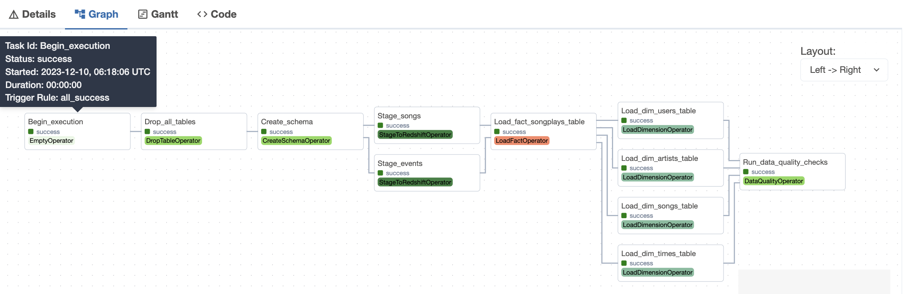

# Airflow

### Purpose
We have performed a data ETL in project 2. Here, we would like to Airflow to do the heavy-lifting and make it a complete, reproducible pipeline.

### Installing Airflow
I have pretty bad connections to the workspace, so I do this on my local machine. Following the instructions on Airflow's website (https://airflow.apache.org/docs/apache-airflow/stable/installation/index.html), in particular this

```
pip install "apache-airflow[celery]==2.7.3" --constraint "https://raw.githubusercontent.com/apache/airflow/constraints-2.7.3/constraints-3.8.txt"'
```

gives an error about failure in installing google-re2. I searched for a while but didn't find good solutions. So I got the google-re2 from conda, then did the pip install. Although it mixed conda and pip, but this actually worked fine.

Similarly, it complained about psycopg2 when installing the apache-airflow-providers-postgres, so I did the same by downloading it from conda.

The rest seems to be fine.

### Files
The dag is defined in dags/final_project.py. Operators are in plugins/project/operators, together with sql statements. The raw json files were downloaded from udacity_dend, and were transferred to my bucket. 

NOTE: There are way too many json files for songs. So I only uploaded the ones starting with A.

### Dag
The Dag is as followed:



From left to right, the tasks are:
1. Drop tables if they exist for reproducibility.
2. Create schema which has all the tables
3. Stage the json files into redshift
4. Insert into the fact table song_plays
5. Insert into the dim tables.
6. Run data quality check

### Dependencies
apache-airflow=2.7.3
google-re2=1.1
python=3.8.18
sqlalchemy=1.4.50 
psycopg2=2.9.9