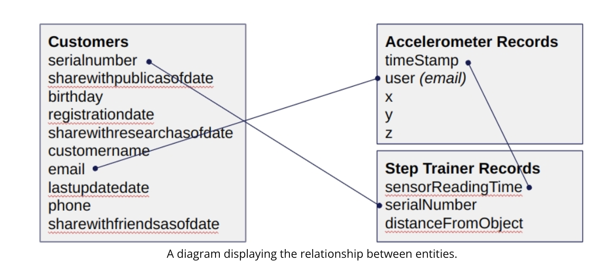

# STEDI Human Balance Analytics

This is part of the requirement for Udacity's nanodegree on data engineering with AWS.

## Project Description

The main goal is to practice engineering a data lakehouse structure, which has three processed stages: landing, trusted and curated.

## Project Data

The raw data is from [nd027-Data-Engineering-Data-Lakes-AWS-Exercises](https://github.com/udacity/nd027-Data-Engineering-Data-Lakes-AWS-Exercises/tree/main). The relationship between tables is as followed:

## Different Processed Stages:

The landing folder has the original dataset in json formats. The trusted folder are the same files but only for users who explicitly agree to share their data. The curated folder has the machine_learning_curated table that is joined from the customer, accelerometer and step_trainer data that is ready for analysis.

## Glue and Athena

This project was done by using AWS Glue and Athena, so there's no dependencies on the local machine.

## Files
The screenhots folder has all the required screenshots showing the counts of tables at different steps. The codes folder has all the generated scripts in glue and glue catalog.

## Some Notes
1. In Glue, there's an option to preview data. However, according to AWS price policy, the preview session is billed in 30 minutes, which is quite expensive for this small project where a typical actual glue job takes less than 5 minutes. A DPU hour costs 0.44 and I think it requires at least 2 DPUs for a spark job. So simply showing a few rows of data is going to cost 0.44, unless one has a very quick mouse+hand to shut it down before data preview pops up. So it's better to stick with the old UI to avoid unpleasant cost. 

2. In Glue, nodes other than SQL nodes are really broken. This is on the AWS side and has nothing to do with Udacity. For example, for example a broken [join node](https://knowledge.udacity.com/questions/1013813)(read under the comments and answers), a broken [filter node](https://knowledge.udacity.com/questions/1017364). So it's MUCH BETTER TO USE **SQL NODE ONLY**
